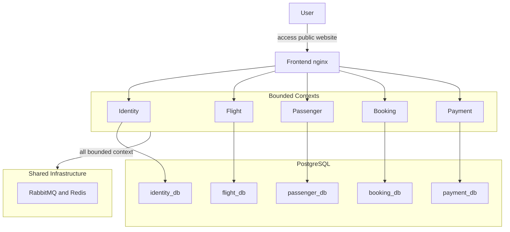

# CLOUD-NATIVE TRAVEL BOOKING MICROSERVICE

- **Live Demo:** [https://www.phuctruongtrangiaa.app/login](https://www.phuctruongtrangiaa.app/login)
- **CloudFront Domain:** `dztx0tthix52u.cloudfront.net`
- **Evidence Pack:** [docs/evidence/README.md](docs/evidence/README.md)
- **Video:** [SharePoint recording](https://buveduvn0-my.sharepoint.com/personal/phuc_ttg_st_buv_edu_vn/_layouts/15/guestaccess.aspx?share=IQDTiE85JDAVTJ0ICfSocxp1AaDQl1HXHorzOD5lwRgiEF8&e=Sd8dzY)

This repository contains a cloud-native travel booking platform built as a multi-service NestJS system with a React/Vite frontend. The runtime is split into dedicated services for `identity`, `flight`, `passenger`, `booking`, and `payment`, with nginx acting as the frontend reverse proxy and browser entrypoint. Shared runtime capabilities include PostgreSQL, RabbitMQ, Redis-backed rate limiting, and OpenTelemetry-based observability.

## Live Access

- Custom domain: [https://www.phuctruongtrangiaa.app/login](https://www.phuctruongtrangiaa.app/login)
- CloudFront distribution: `dztx0tthix52u.cloudfront.net`
- Public entry path: `CloudFront -> ALB -> frontend nginx -> backend services`
- DNS management: custom domain configured through Name.com and mapped to CloudFront

## System Overview

The codebase models a travel booking workflow across five backend bounded contexts plus a frontend SPA:

- `identity`: self-service registration, login/logout/refresh, token validation, current-user profile, admin user management, and user event publication
- `flight`: flights, airports, aircraft, seat inventory, seat holds, seat commit/release workflows, and seat-state queries
- `passenger`: read-model projection of passenger profiles materialized from identity events
- `booking`: checkout orchestration, duplicate-booking protection, booking status transitions, seat hold tracking, and cancel flow
- `payment`: payment intents, admin manual confirmation, backend manual reconcile API, wallet balance, wallet top-up review flow, payment expiry, and refunds
- `frontend`: React/Vite SPA served through nginx, with user and admin screens for the implemented backend flows

## Implemented Capabilities

- Unauthenticated routes: `POST /api/v1/identity/register`, `POST /api/v1/identity/login`, `POST /api/v1/identity/refresh-token`, plus service health probes
- Authenticated identity flow: `POST /api/v1/identity/logout`, `GET /api/v1/user/me`, and admin user CRUD
- Flight catalog flow: bearer-token access to flight list/detail, airports, aircraft, available seats, and seat maps; non-admin flight list queries exclude past `flightDate` values
- Flight admin flow: create airports, aircraft, and flights; `flightDate` input stays backward-compatible but the stored canonical value is derived from `departureDate` using the Asia/Ho_Chi_Minh business day, and seat inventory is auto-generated from the aircraft model
- Passenger flow: `GET /api/v1/passenger/get-all` is admin-only, while `get-by-id` and `get-by-user-id` are owner-or-admin
- Booking flow: create checkout with `Idempotency-Key`, lock seat-aware fare and seat class, enforce one active booking per user and flight, keep a 15-minute payment window, and cancel bookings
- Payment flow: create payment intent, fetch payment by id or booking id as owner-or-admin, batch-fetch payment summaries with a max of 100 ids, confirm payment manually as admin with `Idempotency-Key`, and reconcile bank-transfer payments through a backend API
- Wallet flow: view wallet balance, submit top-up requests, enforce a maximum of 3 pending top-up requests per user, approve or reject top-ups as admin, and pay a booking from wallet balance; wallets are created lazily and balances/ledgers use integer VND amounts
- Event-driven flow: identity-to-passenger sync, payment success and expiry propagation, seat commit/release requests, booking-created emission, and refund processing
- Operations flow: `/health/live`, `/health/ready`, `/metrics`, `/swagger`, smoke scripts, ECS deployment workflows, and observability overlays

## Interface Surface

### Browser and Public HTTP Entry

The frontend nginx proxy exposes the SPA and forwards API calls to the correct service:

| Route family | Upstream | Notes |
| --- | --- | --- |
| `/api/v1/identity/*` | `identity` | Public auth endpoints plus authenticated identity APIs |
| `/api/v1/user/*` | `identity` | Authenticated user APIs |
| `/api/v1/flight/*`, `/api/v1/airport/*`, `/api/v1/aircraft/*`, `/api/v1/seat/*` | `flight` | Read APIs plus admin creation flows |
| `/api/v1/passenger/*` | `passenger` | Passenger projection reads |
| `/api/v1/booking/*` | `booking` | Booking create, list, detail, cancel |
| `/api/v1/payment/*`, `/api/v1/wallet/*` | `payment` | Payment queries, confirmation, reconcile, wallet APIs |
| `/health/live`, `/health/ready` | `frontend nginx` | Frontend liveness and readiness |

nginx also applies request-rate zones for auth-heavy, write-heavy, and read-heavy browser routes before requests reach the backend services.

Only `register`, `login`, `refresh-token`, and health endpoints are unauthenticated. All flight, passenger, booking, payment, and wallet reads above require a bearer token.

### Service-to-Service HTTP

Synchronous service orchestration currently happens in a few explicit places:

- `booking -> flight`: fetch flight details, reserve seat, and read internal seat state
- `booking -> passenger`: resolve passenger projection by `userId`
- `booking -> payment`: create payment intent and fetch payment state
- `flight/passenger/booking/payment -> identity`: `POST /api/v1/identity/validate-access-token` remote introspection when JWT remote introspection is enabled

Signed internal headers are required on routes decorated with `@InternalOnly()`, such as `GET /api/v1/seat/get-state` and `GET /api/v1/internal/health/auth-dependency`. `POST /api/v1/identity/validate-access-token` may receive the same headers from `JwtGuard` when `INTERNAL_SERVICE_AUTH_SECRET` is configured, but the route itself is the remote token-introspection endpoint rather than an internal-only contract.

### Per-service operational endpoints

Every backend service process exposes the same operational surface on its own port:

- `/health/live`
- `/health/ready`
- `/metrics`
- `/swagger`

These endpoints are registered inside each NestJS process and bypass service-level rate limiting. In local Docker Compose they are reachable on the service container ports, while the public browser entrypoint only exposes the frontend nginx health endpoints directly.

### Asynchronous Contracts

RabbitMQ carries the current cross-service contracts implemented in `src/building-blocks/contracts`:

- `UserCreated`, `UserUpdated`
- `UserDeleted`
- `PaymentSucceeded`, `PaymentExpired`, `PaymentFailed`
- `PaymentRefundRequested`, `PaymentRefunded`
- `SeatCommitRequested`, `SeatReleaseRequested`
- `BookingCreated`

## Runtime Patterns

- HTTP/REST is used for browser APIs, booking checkout orchestration, payment lookups, and token introspection.
- AMQP fanout exchanges are used for decoupled workflow transitions and projections.
- `identity`, `booking`, and `payment` persist outbound events in service-local outbox tables and dispatch them asynchronously.
- `passenger`, `booking`, `payment`, and `flight` use processed-message tables to deduplicate consumer work.
- Rate limiting exists both at nginx and inside backend services using Redis-backed counters.
- Request idempotency is enforced on `POST /api/v1/booking/create` and `PATCH /api/v1/payment/confirm/:id`.
- Checkout invariants are runtime-backed: the payment window is 15 minutes, the seat hold lasts 2 minutes longer, and payment summary batch reads are capped at 100 ids.
- Signed internal headers are required only on specific `@InternalOnly()` routes, not on every service-to-service HTTP call.
- Every service exposes readiness, liveness, Prometheus metrics, and Swagger docs in its own process.

## Frontend Coverage

- The SPA routes wired in `src/frontend/src/App.tsx` are `login`, `register`, dashboard, flights, bookings, wallet, and admin pages for users, airports, aircraft, flights, seats, passengers, and `/payments/reconcile`.
- `/payments/reconcile` currently renders `AdminPaymentReconcilePage`, which uses the wallet top-up review APIs (`/api/v1/wallet/topup-requests*`) rather than a dedicated form for `POST /api/v1/payment/reconcile-manual`.
- Manual payment reconcile therefore exists today as a backend capability, but not as a separate browser workflow in the current SPA.

## System Architecture

The implemented system follows a microservice architecture with bounded contexts aligned to travel-booking business capabilities. The frontend is a React/Vite single-page application served through nginx, while `identity`, `flight`, `passenger`, `booking`, and `payment` each own a distinct slice of the domain. RabbitMQ, PostgreSQL, and Redis provide shared runtime capabilities without blurring service ownership.



### Bounded Context Responsibilities

| Service | Primary ownership |
| --- | --- |
| `identity` | Authentication, JWT validation, token revocation checks, user management, user events |
| `flight` | Flights, airports, aircraft, seat inventory, seat holds, seat commit/release |
| `passenger` | Passenger profiles projected from identity events |
| `booking` | Checkout orchestration, booking status transitions, seat hold tracking, cancel flow |
| `payment` | Payment intents, wallet balance and ledgers, manual reconcile, expiry, refunds |
| `frontend` | React/Vite SPA served through nginx |

## Tech Stack

| Area | Technologies |
| --- | --- |
| Frontend | React, Vite, TypeScript, nginx |
| Backend | Node.js, NestJS, TypeScript, TypeORM |
| Database | PostgreSQL 16, logical database per service |
| Messaging | RabbitMQ (`amqplib`, AMQP 0-9-1 fanout exchanges) |
| Rate limiting | Redis (`ioredis`, `rate-limiter-flexible`) |
| Containers | Docker, Docker Compose |
| Cloud deployment | Amazon ECS/Fargate, Amazon ECR, Amazon ALB, Amazon CloudFront, Amazon RDS |
| CI/CD | GitHub Actions, AWS OIDC federation, release manifests in S3 |
| Observability | OpenTelemetry, Prometheus, Tempo, Loki, Grafana |

## Repository Structure

```text
.
├── .github/workflows/        # PR CI, release build, staging deploy
├── deployments/             # Docker Compose, smoke scripts, ECS helpers, SQL/bootstrap, observability configs
├── docs/                    # Architecture, protocols, storage, reliability, runbooks, evidence
└── src/
    ├── building-blocks/     # Shared contracts, auth, telemetry, health, RabbitMQ, rate limiting
    ├── identity/            # Authentication and user service
    ├── flight/              # Flight, airport, aircraft, and seat service
    ├── passenger/           # Passenger projection service
    ├── booking/             # Booking orchestration service
    ├── payment/             # Payment, wallet, and refund service
    └── frontend/            # React/Vite frontend
```

## Local Development

### Prerequisites

- Docker and Docker Compose
- Node.js 20.x if you want to run service-level scripts outside containers

### Start the local stack

```bash
bash deployments/scripts/dev-up.sh
```

This command materializes missing local `.env.docker` files from committed templates and starts the default app stack.

### Start the local stack with observability

```bash
bash deployments/scripts/dev-up.sh --observability
```

This adds Prometheus, Tempo, Loki, Grafana, and the OTEL collector.

### Start the local stack with RDS-style env overlay

```bash
bash deployments/scripts/dev-up.sh --rds
```

This creates missing `.env.rds` files from committed templates and points the service containers at the RDS-style overlay env files.

### Start the local stack with both overlays

```bash
bash deployments/scripts/dev-up.sh --rds --observability
```

### Helpful local commands

```bash
docker compose -f deployments/docker-compose/docker-compose.yaml ps
make wallet-proxy-smoke
bash deployments/scripts/api-smoke.sh
```

If Docker still has containers from an older stack shape, clean them once with:

```bash
docker compose -f deployments/docker-compose/docker-compose.yaml down --remove-orphans
```

## Cloud Deployment Summary

| Item | Value |
| --- | --- |
| AWS Region | `ap-south-1` |
| Compute platform | `Amazon ECS/Fargate` |
| ECS cluster | `travel-booking-cluster` |
| Service discovery domain | `travel-booking.local` |
| Public URL | [https://www.phuctruongtrangiaa.app/login](https://www.phuctruongtrangiaa.app/login) |
| CloudFront domain | `dztx0tthix52u.cloudfront.net` |
| ALB domain | `travel-booking-frontend-alb-1157081880.ap-south-1.elb.amazonaws.com` |
| Database | `Amazon RDS PostgreSQL` |
| Image registry | `Amazon ECR` (`identity`, `flight`, `passenger`, `booking`, `payment`, `frontend`) |
| CI/CD access model | `GitHub Actions + AWS OIDC` |
| Redis usage | Distributed rate limiting and request throttling backend |
| RabbitMQ usage | Asynchronous domain events and workflow coordination |

## CI/CD Workflow

The repository currently contains three GitHub Actions workflows:

- `PR CI`: builds, tests, and validates Docker images for the affected services
- `Main Build Release`: builds changed service images, pushes them to Amazon ECR, and publishes a release manifest to S3
- `Deploy Staging`: downloads a release manifest by git SHA, runs migrations in ECS tasks, updates service task definitions, bootstraps the smoke user, and runs smoke checks

### Staging flow

1. Push to `main`
2. `Main Build Release` determines changed services, builds images, and uploads a release manifest
3. `Deploy Staging` downloads the manifest from S3
4. ECS one-off migration tasks run for non-frontend services
5. ECS services are updated and waited to stability
6. Smoke-user bootstrap and smoke verification run against the public base URL

## Verification Commands

### Public health checks

```bash
curl -i https://www.phuctruongtrangiaa.app/health/live
curl -i https://www.phuctruongtrangiaa.app/health/ready
```

### Smoke-user bootstrap against the deployed stack

```bash
BASE_URL="https://www.phuctruongtrangiaa.app" \
SMOKE_USER_EMAIL="your-smoke-user@example.com" \
SMOKE_USER_PASSWORD="your-password" \
SMOKE_USER_NAME="Smoke User" \
SMOKE_USER_PASSPORT="SMOKE123456" \
SMOKE_USER_AGE="30" \
SMOKE_USER_PASSENGER_TYPE="1" \
bash deployments/scripts/ensure-smoke-user.sh
```

### Smoke verification against the deployed stack

```bash
BASE_URL="https://www.phuctruongtrangiaa.app" \
SMOKE_USER_EMAIL="your-smoke-user@example.com" \
SMOKE_USER_PASSWORD="your-password" \
bash deployments/scripts/api-smoke.sh
```

### Wallet proxy smoke against the local nginx entrypoint

```bash
make wallet-proxy-smoke
```

## Evidence Screenshots

The full screenshot gallery is documented in [docs/evidence/README.md](docs/evidence/README.md). It includes:

- public GitHub repository and live login page
- Name.com DNS, CloudFront domain binding, ALB origin, and CloudFront security view
- multiple GitHub Actions success screenshots
- ECS runtime health, ECR repositories, and RDS instance evidence
- authenticated post-login application screens

## Known Gaps

- `flight` still publishes some events directly to RabbitMQ instead of using a transactional outbox
- The booking service still depends on synchronous downstream HTTP calls and remote token introspection without a circuit breaker
- Payment processing is still a fake/manual simulation rather than a real PSP integration
- The repository does not include sustained load/performance automation
- ECS deployment automation exists, but autoscaling policies and infrastructure-as-code are not defined in this repository
