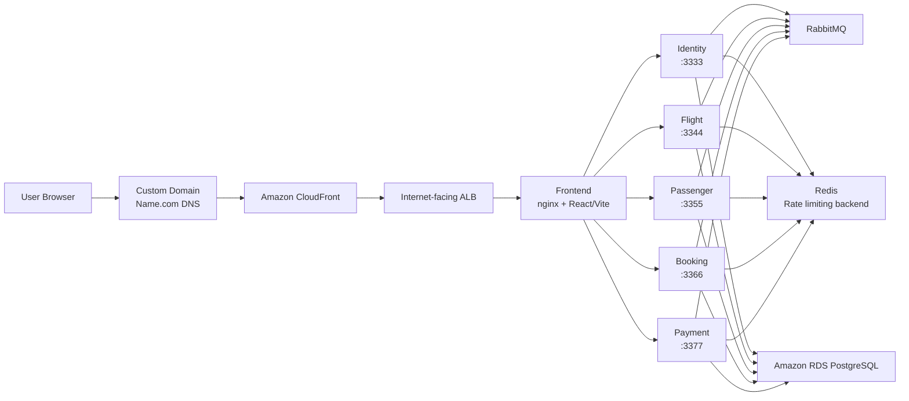

# CLOUD-NATIVE TRAVEL BOOKING MICROSERVICE

**Student:** Truong Tran Gia Phuc - 23080430  
**Live Demo:** [https://www.phuctruongtrangiaa.app/login](https://www.phuctruongtrangiaa.app/login)  
**CloudFront Domain:** `dztx0tthix52u.cloudfront.net`  
**Evidence Pack:** [docs/evidence/README.md](docs/evidence/README.md)

This repository contains a cloud-native travel booking platform built with a microservices architecture. The system exposes a React/Vite frontend through nginx and a custom domain, while backend capabilities are split into dedicated services for identity, flight, passenger, booking, and payment. The deployed environment uses Amazon ECS/Fargate, Amazon RDS PostgreSQL, Amazon ECR, CloudFront, an internet-facing ALB, and GitHub Actions CI/CD with OIDC-based AWS access.

## Live Access

- Custom domain: [https://www.phuctruongtrangiaa.app/login](https://www.phuctruongtrangiaa.app/login)
- CloudFront distribution: `dztx0tthix52u.cloudfront.net`
- Public entry path: `CloudFront -> ALB -> frontend -> backend services`
- DNS management: custom domain configured through Name.com and mapped to CloudFront

## System Overview

The application models a travel booking workflow across multiple bounded contexts. Frontend requests are routed through nginx to backend APIs, while asynchronous cross-service coordination is handled through RabbitMQ. PostgreSQL is used as the persistent data store, and Redis is used as the backend for distributed rate limiting and request throttling.

Supported system capabilities in the codebase include:

- User authentication: register, login, refresh token, logout, current-user profile
- Flight domain: flights, airports, aircraft, seat availability, seat reservation
- Booking domain: create booking, list/detail booking, cancel booking
- Payment domain: payment intent flow, wallet payment, wallet top-up requests, admin manual reconcile
- Event-driven integration: passenger profile sync, payment success/expiry propagation, seat release, and refund coordination

## Key Features

- Microservices architecture with dedicated services for identity, flight, passenger, booking, payment, and frontend
- Public cloud deployment with custom domain access
- Event-driven workflows over RabbitMQ for payment and passenger-sync scenarios
- Service-to-service communication using REST plus internal service discovery
- Centralized cloud image delivery through Amazon ECR
- GitHub Actions CI/CD pipeline for build, release, deployment, and smoke verification
- Deployment-time smoke checks through the public URL
- Local Docker Compose development workflow with optional RDS-style troubleshooting overlay

## System Architecture



### Service Responsibilities

- `identity`: authentication, JWT validation, user management
- `flight`: flights, airports, aircraft, seats, seat reservation and seat pricing
- `passenger`: passenger profiles materialized from identity events
- `booking`: checkout creation, booking lifecycle, cancellation, reservation state
- `payment`: payment intents, wallet flows, expiry handling, reconcile operations
- `frontend`: React/Vite single-page application served through nginx

## Tech Stack

| Area | Technologies |
| --- | --- |
| Frontend | React, Vite, TypeScript, nginx |
| Backend | Node.js, NestJS, TypeScript, TypeORM |
| Database | Amazon RDS PostgreSQL / PostgreSQL 16 |
| Messaging | RabbitMQ (AMQP 0-9-1) |
| Rate limiting | Redis (`ioredis`) |
| Containers | Docker, Docker Compose |
| Cloud deployment | Amazon ECS/Fargate, Amazon ECR, Amazon ALB, Amazon CloudFront |
| CI/CD | GitHub Actions, AWS OIDC federation |
| Observability | OpenTelemetry, Prometheus, Tempo, Loki, Grafana |

## Repository Structure

```text
.
├── .github/workflows/        # PR CI, build/release, staging/production deploy workflows
├── deployments/             # Docker Compose, scripts, SQL bootstrap, observability configs
├── docs/                    # Architecture, protocol, storage, reliability, and runbooks
└── src/
    ├── building-blocks/     # Shared contracts, auth, telemetry, health, RabbitMQ, rate limiting
    ├── identity/            # Authentication and user service
    ├── flight/              # Flight, airport, aircraft, and seat service
    ├── passenger/           # Passenger profile service
    ├── booking/             # Booking orchestration service
    ├── payment/             # Payment and wallet service
    └── frontend/            # React/Vite frontend
```

## Local Development

### Prerequisites

- Docker and Docker Compose
- Node.js 20.x if running service-level scripts locally

### Start the local stack

```bash
bash deployments/scripts/dev-up.sh
```

This command materializes missing local `.env.docker` files from committed templates and starts the Docker Compose stack.

### Start the local stack with RDS-style overlay

```bash
bash deployments/scripts/dev-up.sh --rds
```

Use this when validating local containers against shared RDS-style environment files. The script creates missing `.env.rds` files from committed templates without overwriting existing files.

### Helpful local commands

```bash
docker compose -f deployments/docker-compose/docker-compose.yaml ps
make wallet-proxy-smoke
```

## Cloud Deployment Summary

| Item | Value |
| --- | --- |
| AWS Region | `ap-south-1` |
| Compute platform | `Amazon ECS/Fargate` |
| ECS cluster | `travel-booking-cluster` |
| Service discovery | `travel-booking.local` |
| Public URL | [https://www.phuctruongtrangiaa.app/login](https://www.phuctruongtrangiaa.app/login) |
| CloudFront domain | `dztx0tthix52u.cloudfront.net` |
| ALB domain | `travel-booking-frontend-alb-1157081880.ap-south-1.elb.amazonaws.com` |
| Database | `Amazon RDS PostgreSQL` |
| Image registry | `Amazon ECR` (`identity`, `flight`, `passenger`, `booking`, `payment`, `frontend`) |
| CI/CD access model | `GitHub Actions + AWS OIDC` |
| Redis usage | Distributed rate limiting and request throttling backend |
| RabbitMQ usage | Asynchronous domain events and workflow coordination |

## CI/CD Workflow

The repository contains GitHub Actions workflows for both pull-request validation and deployment automation:

- `PR CI`: builds, tests, and validates Docker images for the affected services
- `Main Build Release`: builds service images, pushes them to Amazon ECR, and publishes a release manifest
- `Deploy Staging`: downloads the release manifest, runs migration tasks, updates ECS task definitions/services, and runs smoke checks through the public URL

Current staging deployment flow:

1. Push to `main`
2. `Main Build Release` builds and pushes updated images to Amazon ECR
3. The release manifest is uploaded for deployment use
4. `Deploy Staging` runs migration tasks, updates ECS services, provisions the smoke user if needed, and executes the smoke suite

## Verification Commands

### Public health checks

```bash
curl -i https://www.phuctruongtrangiaa.app/health/live
curl -i https://www.phuctruongtrangiaa.app/health/ready
```

### Smoke-user bootstrap against the deployed stack

```bash
BASE_URL="https://www.phuctruongtrangiaa.app" \
SMOKE_USER_EMAIL="your-smoke-user@example.com" \
SMOKE_USER_PASSWORD="your-password" \
SMOKE_USER_NAME="Smoke User" \
SMOKE_USER_PASSPORT="SMOKE123456" \
SMOKE_USER_AGE="30" \
SMOKE_USER_PASSENGER_TYPE="1" \
bash deployments/scripts/ensure-smoke-user.sh
```

### Smoke verification against the deployed stack

```bash
BASE_URL="https://www.phuctruongtrangiaa.app" \
SMOKE_USER_EMAIL="your-smoke-user@example.com" \
SMOKE_USER_PASSWORD="your-password" \
bash deployments/scripts/api-smoke.sh
```

The smoke scripts above are part of the repository and are also used by the staging deployment workflow. They validate public accessibility, authentication readiness, and basic end-to-end operational health.

## Evidence Screenshots

The full screenshot gallery is documented in [docs/evidence/README.md](docs/evidence/README.md). It includes:

- public GitHub repository and live login page
- Name.com DNS, CloudFront domain binding, ALB origin, and CloudFront security view
- multiple GitHub Actions success screenshots
- ECS runtime health, ECR repositories, and RDS instance evidence
- authenticated post-login application screens

## Limitations and Scope Statement

- The deployed platform uses Amazon ECS/Fargate rather than EKS.
- Istio and Terraform are not included in this submission.
- Redis is included and used in the running system; Kafka is not used because RabbitMQ is the implemented message broker for asynchronous workflows in this codebase.
- The submission prioritizes a working public cloud deployment, CI/CD evidence, and documented operational verification.
