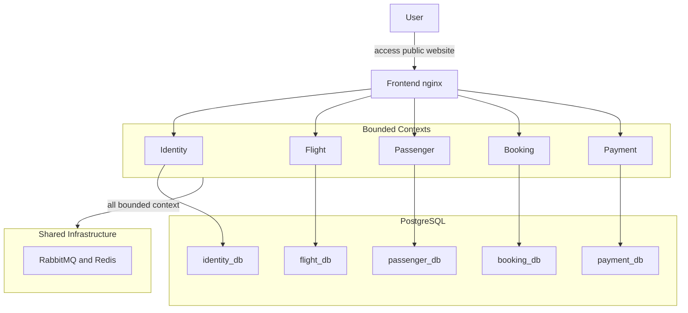

# 3. High-level Architecture

## Architecture Type

The current implementation is a microservice architecture with event-driven workflow coordination. Each service owns its own persistence model and API surface, while RabbitMQ and Redis act as shared runtime infrastructure rather than business-domain owners.

### Runtime interpretation of the diagram

- Browser traffic enters through the frontend nginx layer.
- Backend services are split by bounded context: identity, flight, passenger, booking, and payment.
- Each backend service uses its own logical PostgreSQL database.
- RabbitMQ carries cross-service state transitions and projections.
- Redis backs rate limiting and request throttling decisions inside the backend services.

## Bounded Context Responsibilities

| Context | Owned responsibilities |
| --- | --- |
| `identity` | users, auth tokens, remote token validation, user-event source |
| `flight` | flights, airports, aircraft, sellable seats, seat hold and commit state machine |
| `passenger` | passenger projection derived from identity events |
| `booking` | checkout orchestration, booking lifecycle, seat-hold tracking, cancel flow |
| `payment` | payment intents, manual settlement, manual reconcile backend API, wallet balances and ledgers, refunds |
| `frontend` | browser routes actually wired in `App.tsx`, route protection, dashboard, booking and wallet screens |

## Frontend Coverage vs Backend Capability

- `src/frontend/src/App.tsx` exposes `/login` and `/register` publicly, then protects the rest of the SPA with `ProtectedRoute`.
- Admin-only browser routes are wrapped by `AdminRoute`, including `/payments/reconcile`.
- `/payments/reconcile` renders `AdminPaymentReconcilePage`, which uses the wallet top-up review endpoints rather than a dedicated UI for `POST /api/v1/payment/reconcile-manual`.
- The payment service therefore has one implemented backend capability that is broader than the current SPA coverage: manual transfer reconciliation exists at the API level, but not as a separate browser form.

## Local and Cloud Topology

### Local development

Local runtime uses Docker Compose with:

- `frontend`, `identity`, `flight`, `passenger`, `booking`, `payment`
- `postgres`, `rabbitmq`, `redis`
- optional observability overlay: `prometheus`, `tempo`, `loki`, `grafana`, `otel-collector`

### Cloud deployment

The documented deployment path is:

- CloudFront for public edge delivery
- internet-facing ALB for frontend ingress
- ECS/Fargate services for the frontend and backend workloads
- Amazon RDS PostgreSQL as the shared database platform
- Amazon ECR for image storage
- GitHub Actions workflows for release build and staging deployment

## Cross-Cutting Runtime Capabilities

- health endpoints with component-aware readiness
- Prometheus metrics and OTEL instrumentation
- Redis-backed rate limiting
- remote token introspection through `POST /api/v1/identity/validate-access-token`
- internal request signing for sensitive service-to-service routes
- request idempotency on booking create and admin payment confirm
- RabbitMQ durable delivery with DLQ routing and confirm-channel publishing
