# Evidence Pack

This folder contains the screenshot evidence used to support the deployment, CI/CD, and public-access claims in the root [README](../../README.md).

## Deployment Context

- Public URL: [https://www.phuctruongtrangiaa.app/login](https://www.phuctruongtrangiaa.app/login)
- CloudFront domain: `dztx0tthix52u.cloudfront.net`
- AWS Region: `ap-south-1`
- ECS cluster: `travel-booking-cluster`
- Deployment model: `CloudFront -> Internet-facing ALB -> ECS/Fargate frontend -> backend microservices`

## Evidence Index

| File | What it shows |
| --- | --- |
| [01-github-repo-public.png](01-github-repo-public.png) | Public GitHub repository root and visible project structure |
| [02-live-login-page.png](02-live-login-page.png) | Live login page served from the custom public domain |
| [03-namecom-dns-mapping.png](03-namecom-dns-mapping.png) | Name.com DNS configuration mapping the domain to CloudFront |
| [04-cloudfront-alt-domains.png](04-cloudfront-alt-domains.png) | CloudFront distribution with alternate domain names and certificate |
| [05-cloudfront-origin-alb.png](05-cloudfront-origin-alb.png) | CloudFront origin configured to forward traffic to the frontend ALB |
| [06-cloudfront-security-alb.png](06-cloudfront-security-alb.png) | CloudFront security/protection view associated with the deployed frontend entry point |
| [06-github-actions-success.png](06-github-actions-success.png) | GitHub Actions success evidence, screenshot 1 |
| [07-github-actions-success.png](07-github-actions-success.png) | GitHub Actions success evidence, screenshot 2 |
| [08-github-actions-success.png](08-github-actions-success.png) | GitHub Actions success evidence, screenshot 3 |
| [09-github-actions-success.png](09-github-actions-success.png) | GitHub Actions success evidence, screenshot 4 |
| [10-ecs-services-healthy.png](10-ecs-services-healthy.png) | ECS services or tasks in a healthy/running state |
| [11-ecr-repositories.png](11-ecr-repositories.png) | Amazon ECR repositories for the deployed service images |
| [12-rds-instance.png](12-rds-instance.png) | Amazon RDS PostgreSQL instance used by the deployment |
| [13-dashboard-or-booking-page.png](13-dashboard-or-booking-page.png) | Authenticated application page after successful sign-in |
| [14-dashboard-or-booking-page.png](14-dashboard-or-booking-page.png) | Additional authenticated application state or booking workflow screen |

## Repository and Public Access

### Public GitHub Repository

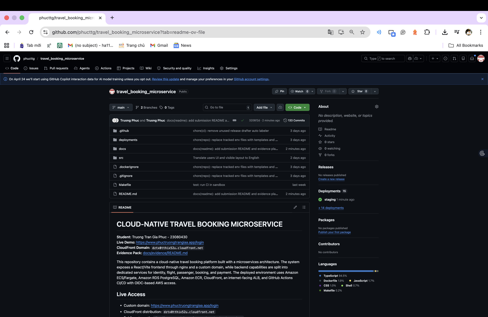

This screenshot confirms that the repository is public and exposes the top-level project structure expected for submission.

### Live Login Page on the Custom Domain

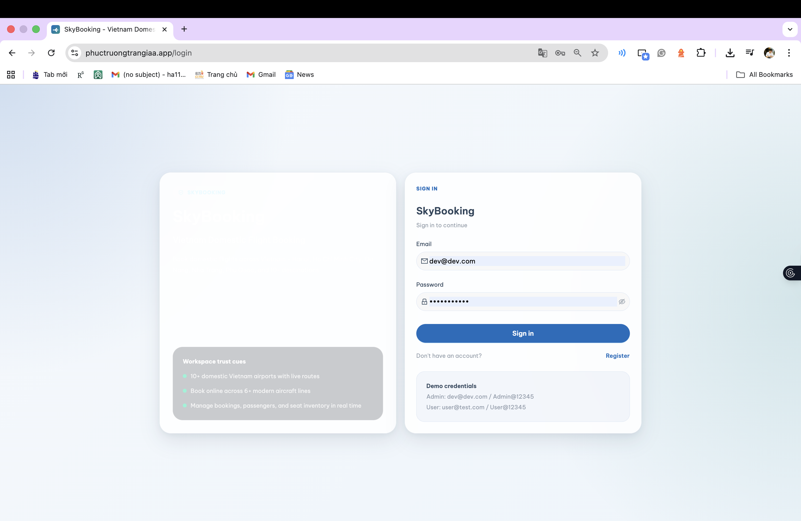

This screenshot shows that the application is publicly reachable through the custom domain and serves the frontend login interface.

## DNS, CDN, and Edge Routing

### Name.com DNS Mapping

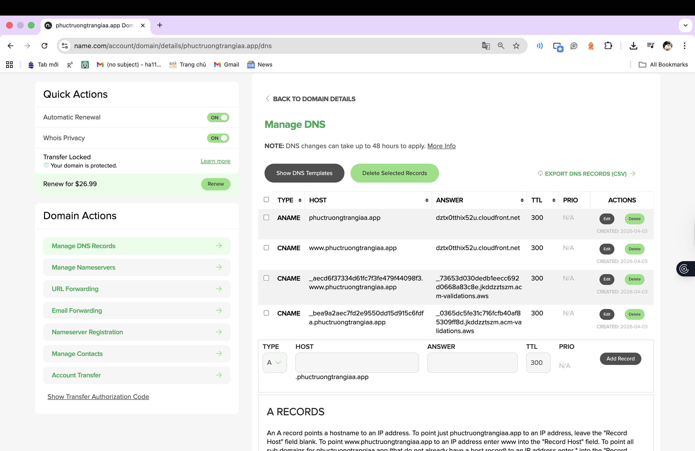

This screenshot shows the custom domain records managed in Name.com and mapped to the CloudFront distribution.

### CloudFront Alternate Domain Names

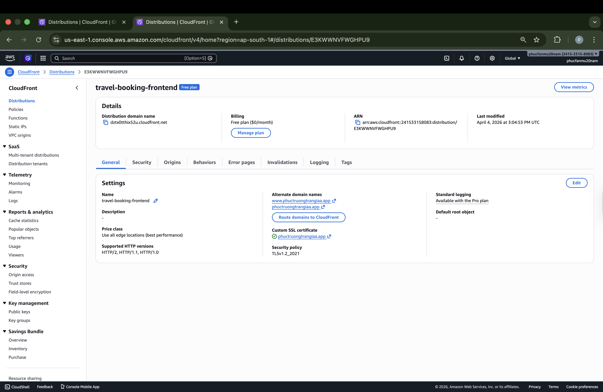

This screenshot shows the CloudFront distribution, alternate domain names, and certificate binding for the deployed frontend.

### CloudFront Origin to ALB

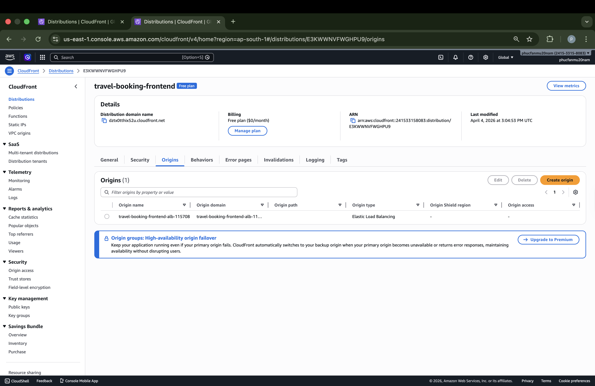

This screenshot shows CloudFront forwarding traffic to the internet-facing Application Load Balancer that fronts the ECS-hosted frontend.

### CloudFront Security View

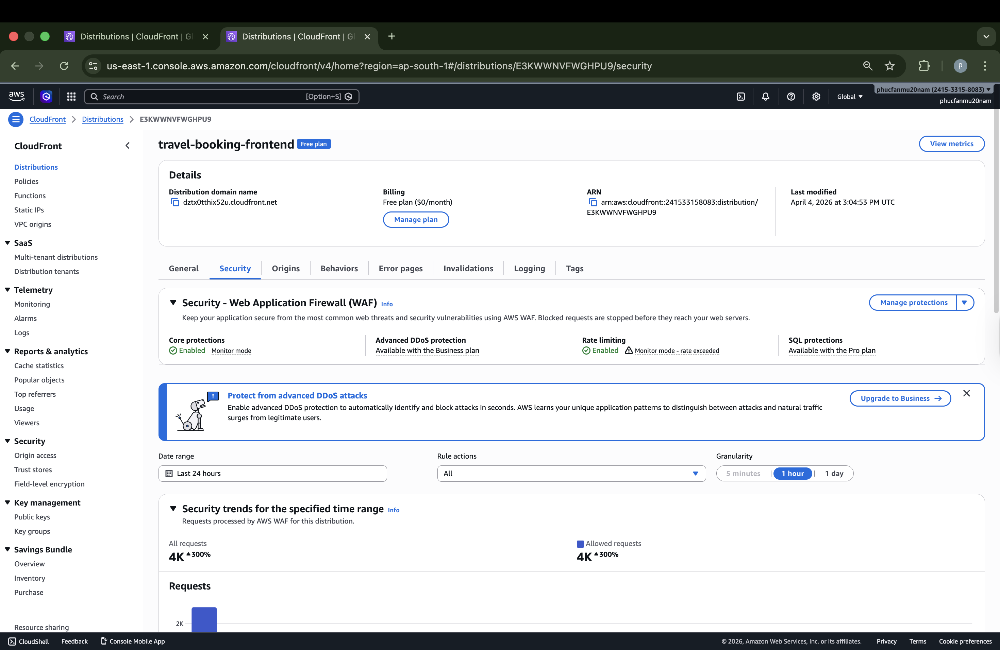

This screenshot records the security/protection view associated with the deployed CloudFront entry point.

## CI/CD Evidence

### GitHub Actions Success Screens

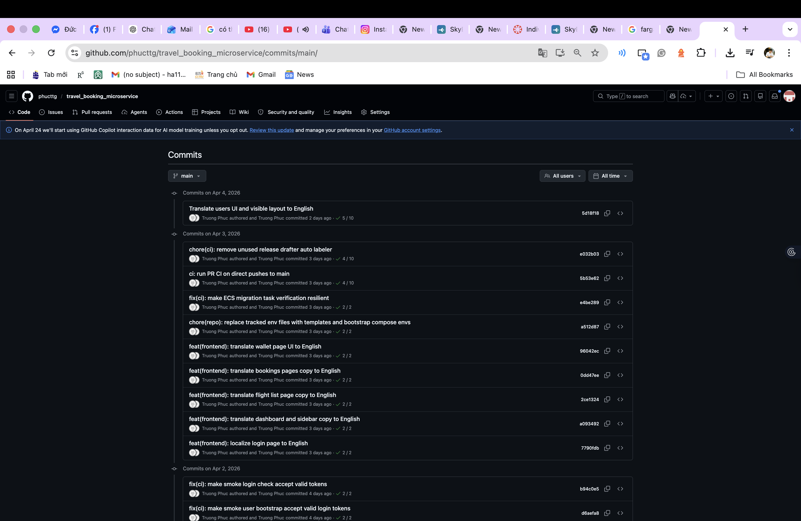

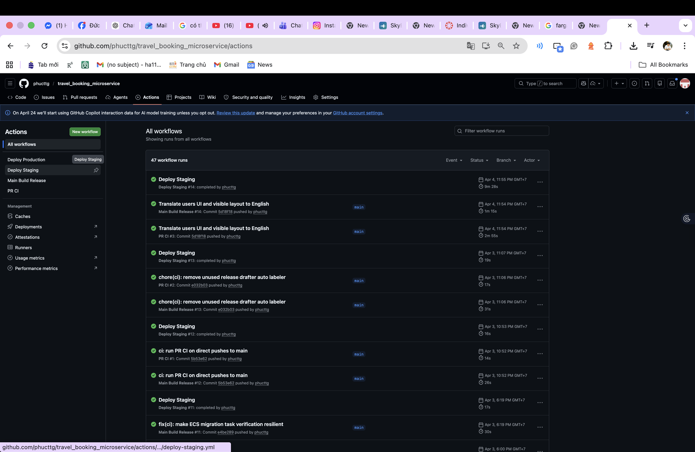
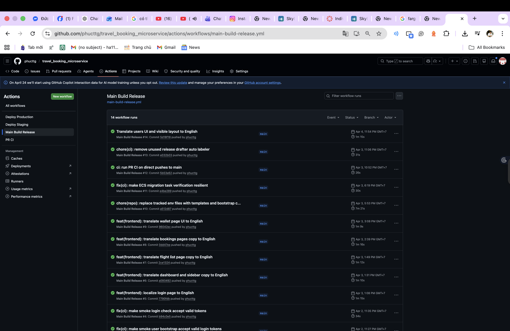

These screenshots document successful GitHub Actions workflow runs for the repository pipeline, supporting the claim that the deployed stack uses CI/CD rather than manual-only deployment.

## Runtime Infrastructure Evidence

### ECS Services or Tasks Healthy

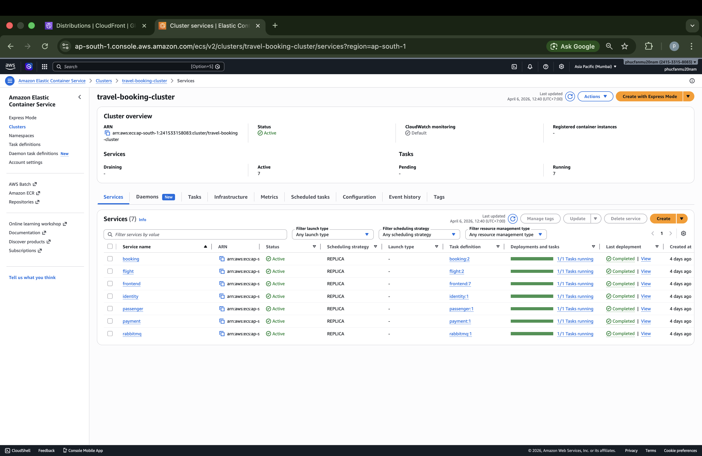

This screenshot shows the ECS runtime state for the deployed services/tasks in `travel-booking-cluster`.

### Amazon ECR Repositories

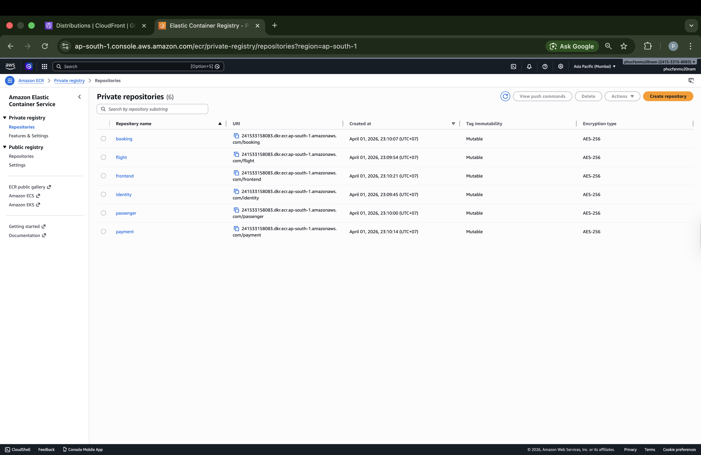

This screenshot confirms the image repositories used by the deployed microservices.

### Amazon RDS Instance

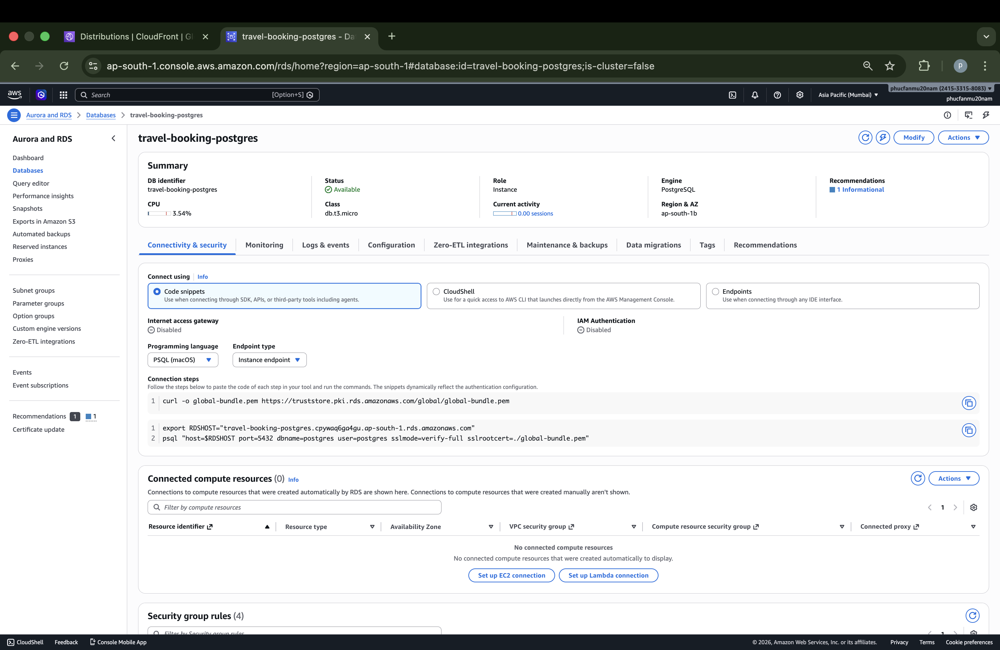

This screenshot confirms the managed PostgreSQL database instance backing the deployment.

## Authenticated Application Evidence

### Authenticated App Screen 1

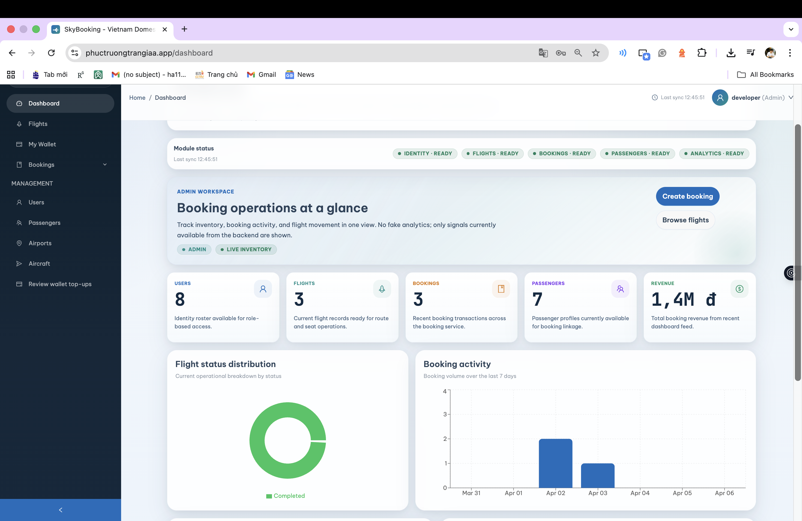

This screenshot shows the application after authentication, demonstrating successful public access beyond the login page.

### Authenticated App Screen 2

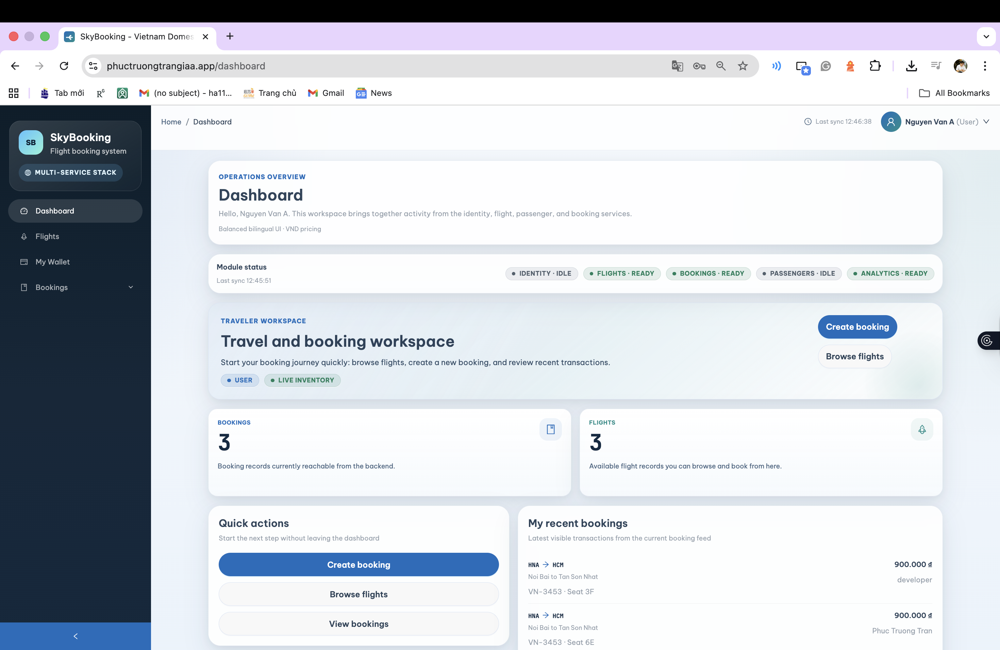

This screenshot provides an additional view of the post-login experience or booking workflow.
